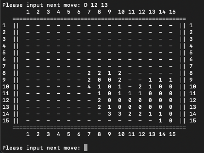
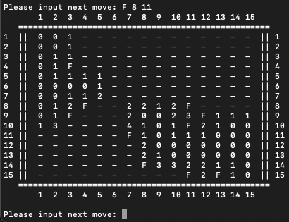
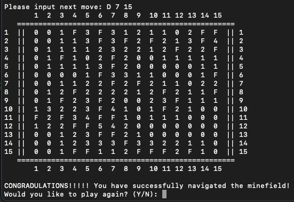
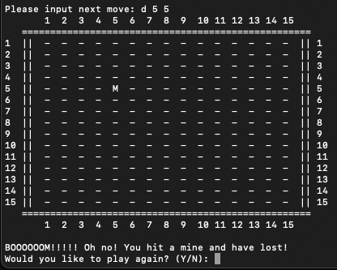

# Minesweeper

A terminal-based recreation of the classic Minesweeper puzzle game, implemented in Python.

## Repository Configuration
| Path| Contents |
|---------------|----------|
| `Images/` | Preview screenshots of the game |
| `MineSweeper.py` | Main program logic and game loop |

## Set up

1. Download `MineSweeper.py` from this repository.
2. Make sure you have Python installed.
3. Run the game from a terminal with:

```bash
python3 MineSweeper.py
```

## How to Play

When the game starts, choose a difficulty (Easy, Medium, Hard), which determines board size and number of mines.

Your goal is to identify where all mines are located without digging into one.

- Dig reveals a location  
- Flag marks a location as suspected mine  
- Numbers represent how many mines are touching that location (including diagonals)
- You lose if you dig into a mine
- You win if you dig all non-mine tiles

## Controls

| Action | Format |
|--------|--------|
| Dig   | `D row column` |
| Flag  | `F row column` |

## Tile Legend

| Symbol | Meaning |
|:------:|---------|
| `-` | Undug tile / unknown |
| `F` | Flagged tile / suspected mine |
| `M` | Mine (revealed when you lose) |
| `0-8` | Number of mines touching that tile (diagonals included) |

## Preview
<p align="center">
    
    
</p>

<p align="center">
    
    
</p>
